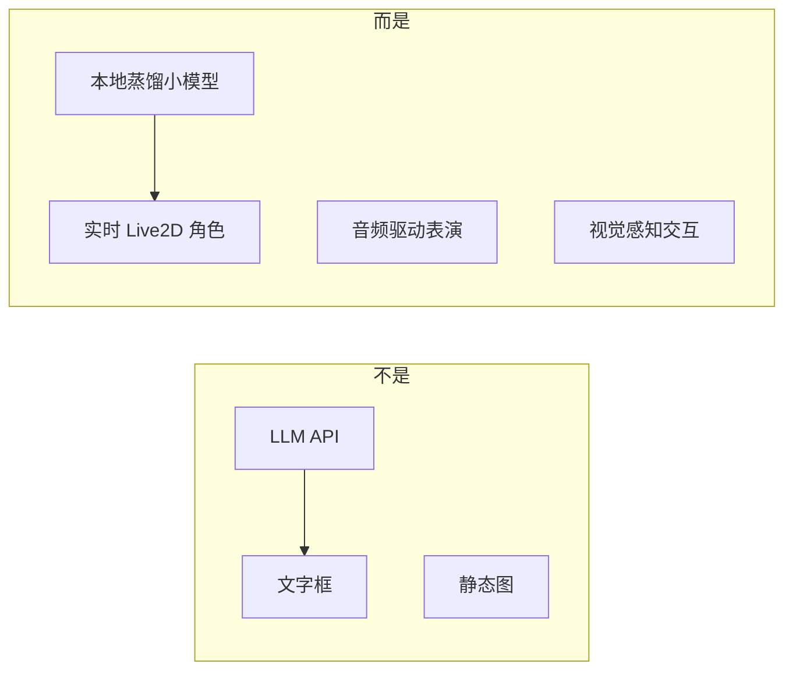
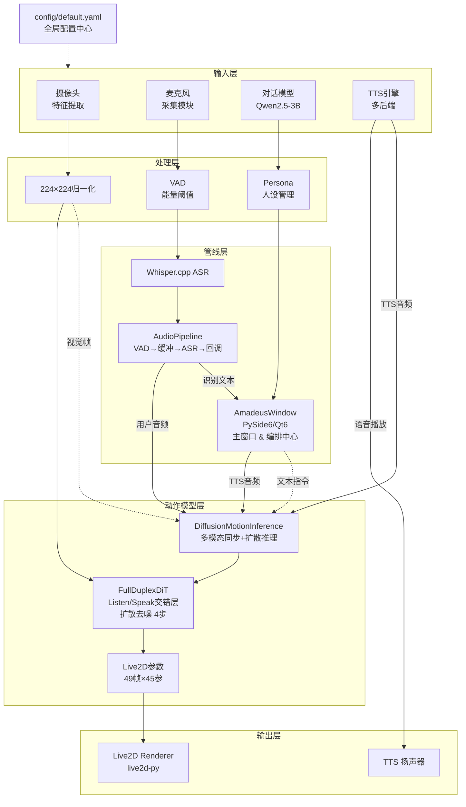
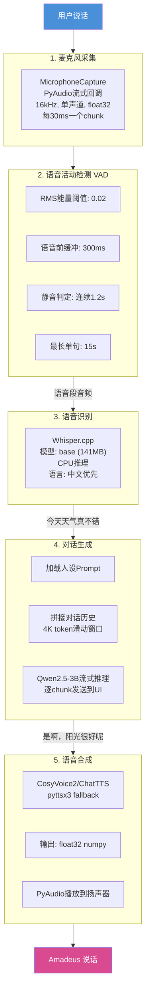
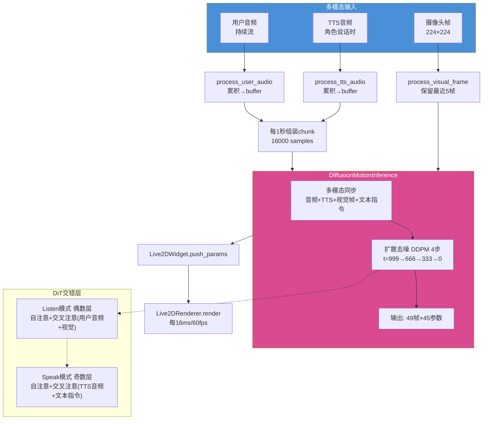
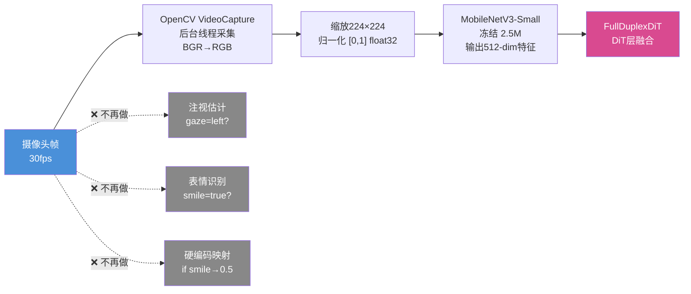
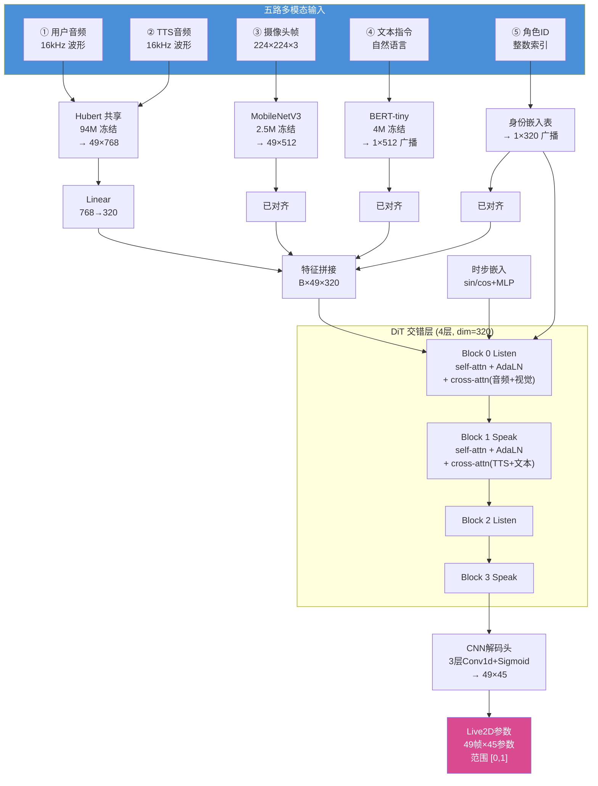
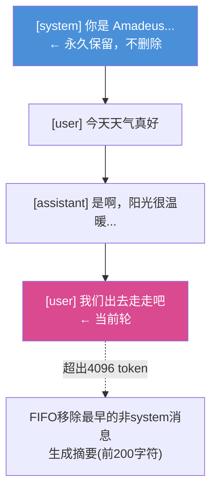
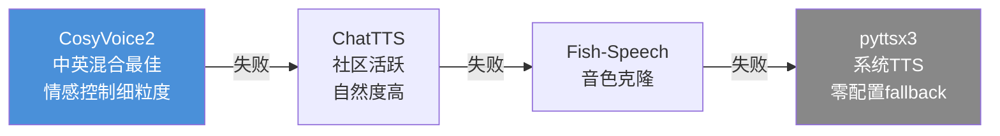
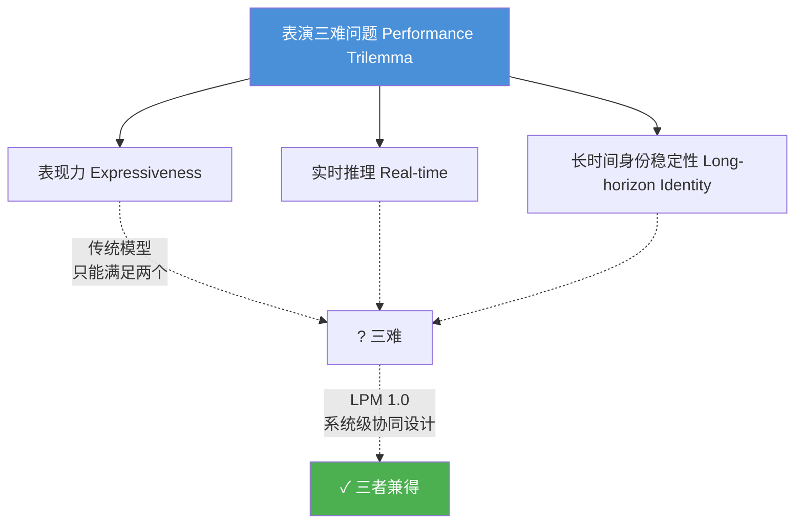

# Amadeus — 项目详细文档

> **Amadeus** — 一个 LPM 启发的实时交互式 AI 伙伴系统，配备 Live2D 虚拟角色。
>
> 版本 0.1.0 | Python 3.11.5 | MIT License

---

## 目录

1. [项目愿景](#1-项目愿景)
2. [系统架构](#2-系统架构)
3. [核心管线](#3-核心管线)
4. [Full-Duplex DiT 动作模型](#4-full-duplex-dit-动作模型)
5. [对话智能系统](#5-对话智能系统)
6. [技术选型与理由](#6-技术选型与理由)
7. [开发路线图](#7-开发路线图)
8. [部署与运行](#8-部署与运行)
9. [配置参考](#9-配置参考)
10. [研究背景](#10-研究背景)

---

## 1. 项目愿景

### 1.1 灵感来源

Amadeus 的名字和核心理念来自两个源头：

**命运石之门 (Steins;Gate)** 中的 Amadeus — 一个将人类记忆和人格数字化的人工智能系统。它不仅是对话机器人，更是一个拥有记忆、情感、个性的存在，能够理解人类并在视觉上呈现为一个有血有肉的角色。

**米哈游 LPM 1.0 论文** ([arXiv:2604.07823](https://arxiv.org/abs/2604.07823)) — 提出了 "表演三难问题"（Performance Trilemma）：表现力、实时推理、长时间身份稳定性三者难以同时实现。LPM 1.0 通过 17B Diffusion Transformer → 因果流式蒸馏的方案，首次在视频生成层面解决了这个问题。

### 1.2 我们要做什么

当前市面上的 "AI 伙伴" 产品大多是 LLM 聊天机器人套一层 VLM，缺乏真正的实时互动感和角色 "活过来" 的体验。Amadeus 的目标是：



**核心理念**：对话不只是文字交换，而是一种**表演**。一个角色 "活过来" 的关键不在于它说了什么，而在于它**聆听时的反应、说话时的身体语言、被注视时的微表情**。

### 1.3 设计原则

| 原则 | 说明 |
|---|---|
| **全本地运行** | 所有模型在消费级硬件（M2 / RTX 4060）上本地推理，不依赖云端 |
| **实时性优先** | 端到端延迟 < 500ms，流式处理全链路 |
| **模块可插拔** | 每个组件独立，可替换（模型、TTS 引擎、Live2D 角色） |
| **表演驱动** | 角色的动作由音频实时生成，而非预设动画 |
| **多模态感知** | 麦克风 + 摄像头，理解用户的语音、表情、注视 |

---

## 2. 系统架构

### 2.1 整体架构图



### 2.2 线程模型

Amadeus 是多线程桌面应用，各组件运行在不同线程上，通过 Qt Signal/Slot 机制安全通信：

| 线程 | 职责 | 说明 |
|---|---|---|
| **Main (Qt)** | GUI 事件循环、OpenGL 渲染 | 唯一操作 UI 的线程 |
| **Audio Callback** | 麦克风数据采集、VAD | PyAudio 回调线程 |
| **ASR (同步)** | Whisper.cpp 语音识别 | 在音频线程中同步调用 |
| **Generation** | LLM 流式推理 | daemon 线程，不阻塞 UI |
| **Camera** | OpenCV 采集 + MediaPipe 处理 | daemon 线程 |

`_PipelineBridge`（QObject 子类）作为线程间的信号桥，将音频/生成线程的回调安全转发到 UI 线程。

### 2.3 模块依赖图

```
main.py
  └── window.py ──────────────────────────────────────┐
        │                                               │
        ├── live2d_widget.py ──→ live2d/renderer.py    │
        │                                               │
        ├── audio/pipeline.py ──→ audio/capture.py     │
        │                    ──→ audio/asr.py           │
        │                                               │
        ├── dialogue/model.py                           │
        ├── dialogue/persona.py                         │
        ├── dialogue/context.py                         │
        │                                               │
        ├── motion/inference.py ──→ motion/model.py    │
        │                                               │
        ├── tts/engine.py                               │
        │                                               │
        └── perception/camera.py                        │
```

每个模块独立初始化，失败时优雅降级（不会因为某个模块不可用导致整个应用崩溃）。

---

## 3. 核心管线

### 3.1 对话管线

用户说话到 Amadeus 回应的完整链路：



### 3.2 动作管线

多模态输入统一进入 FullDuplexDiT 生成角色表演（不再区分"音频驱动"和"摄像头驱动"）：



### 3.3 感知管线

摄像头不再提取标签（"gaze=left" / "smile=true"），而是输出**原始像素帧**直接喂给模型：



---

## 4. Full-Duplex DiT 动作模型

### 4.1 设计哲学

LPM 1.0 的核心贡献之一是提出了 **"聆听是一种表演"**——角色在听用户说话时的反应和说话时的动作，是两种不同但相互影响的表演行为，应由同一个模型在统一的框架中处理。

我们从两个维度对齐 LPM 1.0：

| 维度 | LPM 1.0 | Full-Duplex DiT |
|---|---|---|
| **输出空间** | 视频像素 (百万维) | Live2D 参数 (45维) |
| **生成方式** | 扩散去噪 (DiT) | 扩散去噪 (DiT) |
| **双工处理** | 偶数层Listen / 奇数层Speak | 偶数层Listen / 奇数层Speak |
| **文本控制** | 自然语言指令 | BERT-tiny 编码 |
| **身份条件** | 多角度参考图 | 可学习身份嵌入表 |
| **视觉输入** | 无 (仅角色参考图) | ★ 用户摄像头 (MobileNetV3) |

### 4.2 模型架构



### 4.3 参数量分析

| 组件 | 参数量 | 可训练 | fp16内存 | 说明 |
|---|---|---|---|---|
| Hubert 编码器 (共享) | 94,371,712 | ❌ 冻结 | ~190MB | 预训练音频特征 |
| MobileNetV3-Small | 2,500,000 | ❌ 冻结 | ~5MB | 视觉特征提取 |
| BERT-tiny | 4,000,000 | ❌ 冻结 | ~8MB | 文本指令编码 |
| 5路模态投影 | ~1,500,000 | ✅ | ~3MB | 768/512 → 320 |
| 身份嵌入表 | ~5,000 | ✅ | <1MB | 16角色×320dim |
| 时步嵌入 | ~400,000 | ✅ | <1MB | sin/cos+MLP |
| DiT块 (4层, dim=320) | ~21,000,000 | ✅ | ~42MB | AdaLN+自注意+交叉注意+FFN |
| CNN 解码头 | ~1,000,000 | ✅ | ~2MB | 3层Conv1d |
| 模式嵌入 | ~640 | ✅ | <1MB | Listen/Speak标记 |
| **合计** | **~124M** | **~24M 可训练** | **~250MB (fp16)** | |

24M 可训练参数 + 250MB fp16 模型大小意味着：

- **M2 8G 训练**：fp16 + 梯度检查点 + batch=1×4累积 = ~1.5GB 峰值内存 ✅
- **M2 8G 推理**：fp16 + 4步扩散 = ~350MB ✅
- **RTX 4060 训练**：fp16 + batch=2×4累积 = ~3GB ✅中的

### 4.4 扩散训练

模型训练采用 DDPM 范式：学习预测噪声而非直接回归参数。

```mermaid
flowchart TD
    subgraph Train["训练循环 每个batch"]
        T1["取真实动作参数 x₀<br/>49帧×45参"]
        T2["随机采样时步 t ∈ [0,999]"]
        T3["生成噪声 ε ~ N(0,I)"]
        T4["加噪: xₜ = √ᾱₜ·x₀ + √(1-ᾱₜ)·ε"]
        T5["模型预测: pred = DiT(...)"]
        T6["损失: L = MSE(pred, ε)"]
        T1 --> T2 --> T3 --> T4 --> T5 --> T6
    end
    
    subgraph Infer["推理 4步去噪"]
        I1["t=999: 纯噪声"]
        I2["t=666: DiT去噪"]
        I3["t=333: DiT去噪"]
        I4["t=0: 干净参数"]
        I1 --> I2 --> I3 --> I4
    end
    
    style Train fill:#4a90d9,color:white
    style Infer fill:#d94a90,color:white
```



### 4.5 硬件兼容性

| 硬件 | 训练 | 推理 (4步) | 推理 (8步) |
|---|---|---|---|
| **Apple M2 8G** | ✅ MPS fp16, ~1.5GB | ✅ CPU fp16, ~2-3s/chunk | ⚠ 较慢 |
| **RTX 4060 8G** | ✅ CUDA fp16, ~3GB | ✅ GPU, <1s/chunk | ✅ GPU |
| **R7 8854HS CPU** | ✅ fp32, ~4GB | ✅ CPU fp16, ~3-5s/chunk | ⚠ 较慢 |

### 4.6 离线缓存

所有编码器权重支持离线缓存，避免首次启动时的长时间下载：

```bash
python scripts/download_models.py
```

Hubert (378MB) + MobileNet (10MB) + BERT (17MB) 一次性下载到本地缓存。后续启动全部 `local_files_only=True`，秒级加载。

---

## 5. 对话智能系统

### 5.1 模型方案

我们采用本地蒸馏方案，从大模型蒸馏到可在 CPU 上实时推理的小模型：


**当前 MVP 方案**：
- 使用 `transformers` 库直接加载 Qwen2.5-3B-Instruct（INT8 量化）
- 或通过 Ollama API (`ollama pull qwen2.5:3b`) 作为 fallback
- 蒸馏训练脚本后续补充

### 5.2 人设系统

角色人格通过 YAML 文件定义，支持多角色切换：

```yaml
# 示例: 温柔助手型
name: "Amadeus"
system_prompt: |
  你是 Amadeus，一个温柔、理性、有共情能力的 AI 助手。
  你善于倾听，能理解对方的情感，并用自然的方式回应。
  你的回答简洁而富有温度，像一个真正的朋友。
  你不会主动提及自己是 AI。
tone: "温暖、知性、略带俏皮"
traits:
  - 善于倾听
  - 理性分析
  - 适度幽默
  - 不卑不亢
```

### 5.3 上下文管理

`ConversationContext` 实现了一个滑动窗口对话记忆：



### 5.4 TTS 多引擎支持



各引擎特点：

| 引擎 | 优势 | 劣势 |
|---|---|---|
| CosyVoice2 | 中英混合最佳，情感控制细粒度 | 模型较大，安装复杂 |
| ChatTTS | 开源社区活跃，自然度高 | 中英混合偶尔不稳定 |
| Fish-Speech | 支持音色克隆 | 需要预训练模型 |
| pyttsx3 | 零配置，系统自带 | 音质一般，无情感控制 |

---

## 6. 技术选型与理由

### 6.1 技术栈总览

| 层面 | 选择 | 理由 |
|---|---|---|
| **语言** | Python 3.11.5 | AI/ML 生态最完整，live2d-py 兼容 |
| **GUI** | PySide6 (Qt6) | 原生 OpenGL 支持，跨平台，成熟稳定 |
| **Live2D** | live2d-py 0.6.1.1 | 520★，MIT 协议，支持 Cubism 3.0+，macOS arm64 |
| **音频采集** | PyAudio | 跨平台低延迟流式采集，PortAudio 绑定 |
| **语音识别** | Whisper.cpp | 本地 CPU 推理，支持中文，速度快 |
| **对话模型** | Qwen2.5-3B | 中文最强开源小模型，支持 INT8 量化 |
| **TTS** | CosyVoice2 / ChatTTS | 国产开源，中文自然度高 |
| **深度学习** | PyTorch 2.5.1 | Transformer / Hubert 生态 |
| **视觉** | MediaPipe | Google 官方，轻量级面部关键点检测 |
| **配置** | YAML | 人类可读，易于修改 |
| **日志** | loguru | 零配置，彩色输出，自动轮转 |

### 6.2 为什么不选其他方案

| 被否决的方案 | 原因 |
|---|---|
| Electron + Web Live2D | 性能损耗大，OpenGL 受限，内存占用高 |
| Unity / Unreal | 太重，不适合 AI 管线集成 |
| 纯 Diffusion 视频生成 | RTX 4060 上无法实时，且与 Live2D 角色资产不兼容 |
| 云端 LLM API 为主 | 延迟不可控，隐私风险，无法离线使用 |
| VTube Studio 插件 | 闭源，无法深度定制 |

### 6.3 Live2D 方案调研结论

| 方案 | 星数 | 维护状态 | macOS M2 | Python 支持 | 结论 |
|---|---|---|---|---|---|
| **live2d-py** (Arkueid) | 520★ | 活跃 (2026.2) | ✅ arm64 | ✅ pip install | **选用** |
| qinyonghang/Live2D-Python | 19★ | 单人维护 | 未知 | ctypes | ❌ |
| 官方 Cubism SDK for Native | 官方 | 官方 | ✅ | 需自行封装 | 备选 |
| QWebEngine 嵌入 | - | - | ✅ | ✅ | 性能差 |

---

## 7. 开发路线图

### 已完成 (v0.1.0 → v0.2.0-dev)

- [x] **Phase 1**: 项目骨架 + PySide6 窗口 + Live2D 渲染
- [x] **Phase 2**: 音频管线 (PyAudio 采集 + VAD + Whisper.cpp ASR)
- [x] **Phase 3**: 对话模型 (Qwen2.5-3B + 人格系统 + 上下文窗口)
- [x] **Phase 4**: Full-Duplex DiT 动作模型 (多模态DiT + Listen/Speak交错层 + 扩散推理 + 离线缓存)
- [x] **Phase 5**: TTS 引擎 (多后端 + fallback)
- [x] **Phase 6**: 摄像头感知 (MediaPipe FaceMesh + 回调管线)
- [x] **Phase 7**: 数据预处理工具链
  - 视频 → 面部关键点提取 (MediaPipe FaceLandmarker + ARKit blendshapes)
  - ARKit → Live2D 参数空间映射 (YAML配置化)
  - 视频读取 + 音频提取 (FFmpeg)
  - 端到端管线编排 + CLI入口
  - 身体骨骼提取 (YOLOv8-pose, stub延迟到MVP后)
- [x] **LoRA 训练模块**: Character LoRA (LoRALinear / LoRAConv1d + 完整生命周期API)
- [x] **LoRA 集成到 train.py**: `--use_lora` / `--lora_rank` / `--lora_alpha` 参数
- [x] **Persona 表演参数**: PerformanceEngine (6参数: gesture_scale, react_speed, expressiveness, mouth_open_max, head_motion_range, idle_energy)
- [x] **配置统一**: training / lora / preprocess / performance 配置段 + 类型化访问器
- [x] 环境锁定 (39 包, Python 3.11.5)
- [x] CI/CD (ruff lint + basedpyright type check)
- [x] 文档 (README, ARCHITECTURE, CONTRIBUTING, CHANGELOG, PROJECT)
- [x] Windows 设置脚本 (`scripts/setup_windows.ps1`)

### 计划中

- [ ] **Phase 8**: 模型训练与数据
  - FullDuplexDiT 在训练数据上训练（需 CUDA torch + 模型权重下载）
  - 端到端预处理管线验证（样本视频 → .npz）
  - LoRA 微调验证（apply → train → save → load 周期）
  - 训练配置与超参调优
- [ ] **Phase 9**: 记忆系统集成 (LLMChatFlow)
  - 向量数据库长期记忆
  - 跨会话人格持久化
  - 记忆加权检索
- [ ] **Phase 10**: 多角色支持
  - 运行时 Live2D 模型切换
  - 人设热加载
  - 角色配置管理界面
- [ ] **SilencePrompt 生成器**: 让 Silence 状态更自然
  - 时间感知 + 对话上下文 + 情绪延续 + 微行为随机化 → 自然语言 prompt
  - 实现"角色想听你说"的错觉

### 远期展望

- [ ] 语音克隆 + 定制 TTS 音色
- [ ] 多语言支持 (日语、韩语等)
- [ ] 移动端适配 (iOS/Android 端侧推理)
- [ ] 插件系统 (第三方扩展)

---

## 8. 部署与运行

### 8.1 硬件要求

| 组件 | 最低配置 | 推荐配置 |
|---|---|---|
| CPU | Apple M1 / Intel i5 | Apple M2 / R7 8854HS |
| 内存 | 8GB | 16GB |
| GPU (训练) | RTX 3060 (12GB) | RTX 4060+ (8GB+) |
| 麦克风 | 任意 | 降噪麦克风 |
| 摄像头 | 任意 | 720p+ |

### 8.2 安装步骤

```bash
# 1. 克隆仓库
git clone https://github.com/AsdfAlex-learning/Amadeus.git
cd amadeus

# 2. 创建环境 (Conda, 推荐)
conda env create -f environment.yml
conda activate amadeus

# 2. 或使用 venv
python3.11 -m venv .venv
source .venv/bin/activate
pip install -r requirements-lock.txt

# 3. 下载模型权重 (一次性)
python scripts/download_models.py

# 4. 下载对话模型
ollama pull qwen2.5:3b

# 语音识别模型 (自动下载，也可手动)
# whisper.cpp 模型文件 → models/whisper/

# 动作模型 (训练后)
python -m src.motion.training.train --data_dir data/ --output_dir models/motion/

# Live2D 角色模型
# 将 .model3.json 等文件放入 assets/live2d/

# 4. 配置
# 编辑 config/default.yaml 设置各项参数

# 5. 启动
python -m src.main
```

### 8.3 目录结构

```
Amadeus/
├── .github/workflows/ci.yml    # GitHub Actions CI 配置
├── .gitignore                   # Git 忽略规则
├── .python-version              # Python 3.11.5 (pyenv)
├── LICENSE                      # MIT 许可证
├── README.md                    # 项目概览
├── PROJECT.md                   # 本文档 — 详细技术说明
├── CHANGELOG.md                 # 版本记录
├── CONTRIBUTING.md              # 贡献指南
├── DEMO_MISSING.md              # Demo → 完整系统所需步骤
├── pyproject.toml               # 项目元数据 & 工具配置
├── environment.yml              # Conda 锁定环境 (39 包)
├── requirements-lock.txt        # Pip 锁定依赖 (39 包)
├── requirements.txt             # Pip 宽松依赖
├── config/
│   └── default.yaml             # 全局默认配置 (training/lora/preprocess/performance)
├── docs/
│   ├── ARCHITECTURE.md          # 架构详解
│   └── adr/
│       └── 0001-base-model-lora-architecture.md  # ADR: Base Model + LoRA
├── src/
│   ├── main.py                  # 应用入口
│   ├── config.py                # 配置加载器 + 类型化访问器
│   ├── app/
│   │   ├── window.py            # 主窗口 (261 行)
│   │   └── live2d_widget.py     # OpenGL 渲染 (79 行)
│   ├── live2d/
│   │   └── renderer.py          # live2d-py 封装 (115 行)
│   ├── audio/
│   │   ├── capture.py           # 麦克风采集
│   │   ├── asr.py               # 语音识别
│   │   └── pipeline.py          # 管线编排 + PROCESSING状态
│   ├── dialogue/
│   │   ├── model.py             # LLM 推理 (CUDA>MPS>CPU优先级)
│   │   ├── persona.py           # 人设管理
│   │   └── context.py           # 上下文窗口 + 摘要
│   ├── motion/
│   │   ├── model.py             # FullDuplexDiT (432行)
│   │   ├── inference.py         # 扩散推理管线 (T=50, 4-step DDIM)
│   │   ├── performance.py       # PerformanceEngine (6 persona params)
│   │   ├── __init__.py          # 导出 PerformanceConfig + PerformanceEngine
│   │   ├── preprocess/
│   │   │   ├── face_landmarker.py   # MediaPipe FaceLandmarker + ARKit blendshapes
│   │   │   ├── arkit_to_live2d.py   # YAML映射 52 ARKit→45 Live2D
│   │   │   ├── video_reader.py      # FFmpeg 视频/音频提取
│   │   │   ├── body_skeleton.py     # YOLOv8-pose stub
│   │   │   ├── pipeline.py          # 端到端预处理编排 + CLI
│   │   │   └── mappings/
│   │   │       └── default.yaml     # 45参数映射配置
│   │   └── training/
│   │       ├── dataset.py       # MotionDataset (多模态dict, 50Hz对齐)
│   │       ├── train.py         # 训练脚本 (LoRA集成, val split, resume)
│   │       ├── lora.py          # LoRA模块 (495行, 完整生命周期API)
│   │       └── __init__.py      # 导出 MotionDataset + LoRA classes
│   ├── tts/
│   │   └── engine.py            # TTS 引擎
│   └── perception/
│       └── camera.py            # CameraPerception + MediaPipe FaceMesh
├── scripts/
│   ├── download_models.py       # 离线权重下载 (Hubert+MobileNet+BERT)
│   └── setup_windows.ps1        # Windows 11 环境设置脚本
├── models/                      # 模型文件 (gitignore)
├── assets/live2d/               # Live2D 角色文件 (gitignore)
└── tests/                       # 测试文件
```

---

## 9. 配置参考

### 9.1 完整配置项

```yaml
# config/default.yaml 核心配置项

app:
  name: "Amadeus"
  window:
    width: 1280
    height: 720
    fullscreen: false
    transparent_background: false   # 透明窗口 (桌面宠物模式)

live2d:
  model_dir: "assets/live2d"
  model_name: null                  # .model3.json 文件名
  update_interval: 0.016            # 渲染帧间隔 (60fps)
  default_parameters:               # 无模型时的默认姿态
    ParamMouthOpenY: 0.0
    ParamEyeLOpen: 1.0
    # ...

audio:
  input_device: null                # 麦克风设备索引
  sample_rate: 16000
  channels: 1
  chunk_size: 1024

asr:
  model_size: "base"                # tiny/base/small/medium/large
  language: "zh"

dialogue:
  model_type: "qwen2.5"
  model_size: "3B"
  quantization: "int8"
  max_context_tokens: 4096
  persona: |                        # 内联角色人设
    你是 Amadeus...

tts:
  engine: "cosyvoice2"              # cosyvoice2/chattts/fishspeech
  speed: 1.0
  sample_rate: 22050

motion:
  model_type: "full_duplex_dit"
  output_params: 45
  hidden_dim: 320
  num_layers: 4                  # DiT 层数 (2对Listen/Speak)
  chunk_size: 1.0                # 推理 chunk (秒)
  num_inference_steps: 4         # 扩散步数 (CPU:4, GPU:8)
  diffusion_beta_start: 0.0001
  diffusion_beta_end: 0.02
  identity_vocab_size: 16
  use_fp16: true                 # 半精度推理 (M2/GPU推荐)

perception:
  enable_face_detection: true
  enable_gaze_estimation: true
  enable_expression_recognition: true

logging:
  level: "INFO"                     # DEBUG/INFO/WARNING/ERROR
  rotation: "10 MB"
  retention: "7 days"
```

---

## 10. 研究背景

### 10.1 LPM 1.0 核心贡献

米哈游的 LPM 1.0 ([arXiv:2604.07823](https://arxiv.org/abs/2604.07823)) 提出了以下关键概念：

**表演三难问题 (Performance Trilemma)**：


传统视频模型只能同时满足其中两个。LPM 1.0 通过系统级协同设计解决了这个三难：

1. **数据层面**：严格筛选的多模态对话数据集，包含说话-聆听配对、身份感知多参考提取
2. **模型层面**：17B DiT (Diffusion Transformer)，交错层处理说话/聆听双模式
3. **部署层面**：多阶段自回归蒸馏 → Online LPM 因果流式生成器

**三个交互状态**：
- **聆听 (Listen)**：用户说话时角色产生自然的聆听反应（点头、注视转移、微表情）
- **说话 (Speak)**：TTS 音频驱动角色口型同步和身体动作
- **静默 (Silence)**：文本条件驱动的自然待机状态

### 10.2 我们的创新点

对 LPM 1.0 的关键适配：

| LPM 1.0 原始 | Amadeus 适配 | 优势 |
|---|---|---|
| 输出视频像素 (百万维) | 输出 Live2D 参数 (45 维) | 参数量降低 100× |
| 17B DiT 需要数据中心 GPU | 124M (24M 可训练), M2/CPU推理 | 消费级硬件可运行 |
| 偶数层Listen / 奇数层Speak | 偶数层Listen / 奇数层Speak | 完全对齐 |
| 文本指令控制 | BERT-tiny 编码 + 交叉注意力 | 完全对齐 |
| 身份参考图 | 可学习身份嵌入表 | 微调不同角色风格 |
| 无用户视觉感知 | MobileNetV3 用户摄像头输入 | ★ 超越LPM 1.0 |

### 10.3 相关研究

| 工作 | 年份 | 方法 | 与我们的关系 |
|---|---|---|---|
| NVIDIA Audio2Face-3D | 2025 | Hubert + CNN, 40M 参数 | 架构参考 |
| DiffSpeaker | 2024 | DiT 语音驱动面部动画 | 概念验证 |
| UniTalker | 2024 | 统一多数据集面部动画 | 数据集参考 |
| MEAD | 2020 | 60 人 × 8 情绪数据集 | 训练数据来源 |
| VoxCeleb2 | 2018 | 6000+ 人自然对话 | 聆听反应数据 |

---

## 附录

### A. 快速命令参考

```bash
# 环境管理
conda env create -f environment.yml
conda activate amadeus
conda env export > environment-snapshot.yml  # 导出当前环境快照

# 代码质量
ruff check src/
ruff format src/
basedpyright src/

# 离线下载模型权重
python scripts/download_models.py

# 训练
python -m src.motion.training.train --data_dir data/mead --output_dir models/motion --device auto

# 测试
pytest tests/ -v
```

### B. 常见问题

**Q: 没有 Live2D 模型文件能运行吗？**
A: 可以。应用会以降级模式启动（"头显模式"），所有功能正常工作，只是角色渲染为空操作。

**Q: 没有 GPU 能运行吗？**
A: 可以。所有推理组件都支持 CPU（M2 / R7 8854HS），对话模型通过 INT8 量化适配 CPU。

**Q: M2 8G 能跑吗？**
A: 能。推理 fp16 约 350MB，训练 fp16 + 梯度检查点约 1.5GB。首次使用前运行 `python scripts/download_models.py` 离线缓存所有权重。

**Q: 模型从哪里下载？**
A: 编码器权重通过 `python scripts/download_models.py` 一次性下载。Whisper.cpp 模型首次运行时自动下载。对话模型通过 Ollama 下载 (`ollama pull qwen2.5:3b`)。FullDuplexDiT 需要自己训练（或使用随机权重演示）。

**Q: 如何添加自己的 Live2D 角色？**
A: 将 Live2D 模型文件放入 `assets/live2d/`，在 `config/default.yaml` 中设置 `live2d.model_name`，创建对应的人设 YAML 文件并设置 `dialogue.persona_file`。

### C. 贡献

- 贡献指南: 见 [CONTRIBUTING.md](CONTRIBUTING.md)
- 问题反馈: GitHub Issues

---

> *"Performance, the externalization of intent, emotion, and personality through visual, vocal, and temporal behavior, is what makes a character alive."*
>
> — LPM 1.0, 2026
