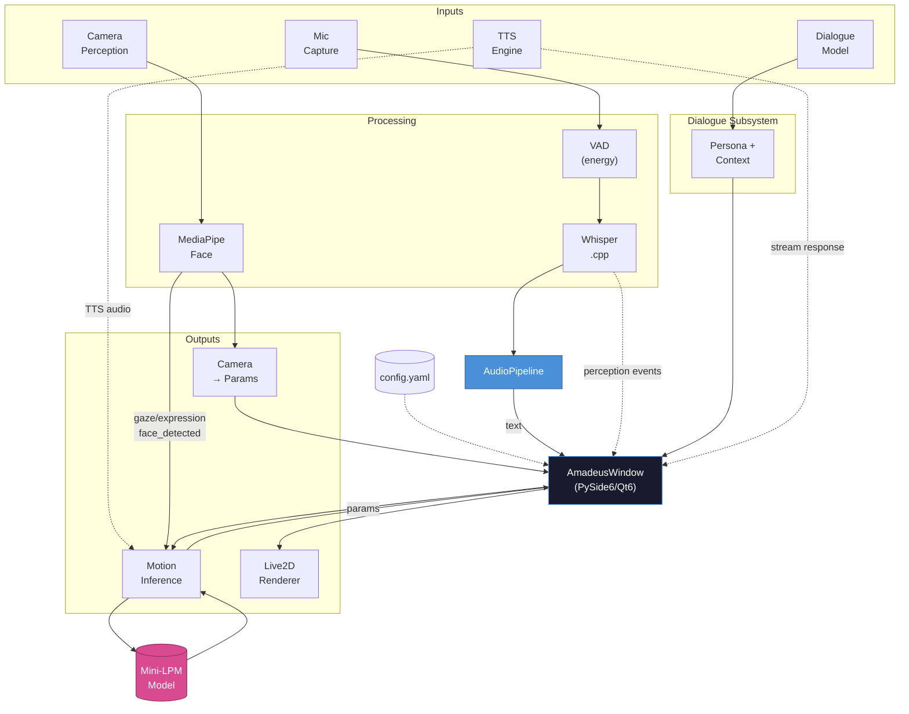
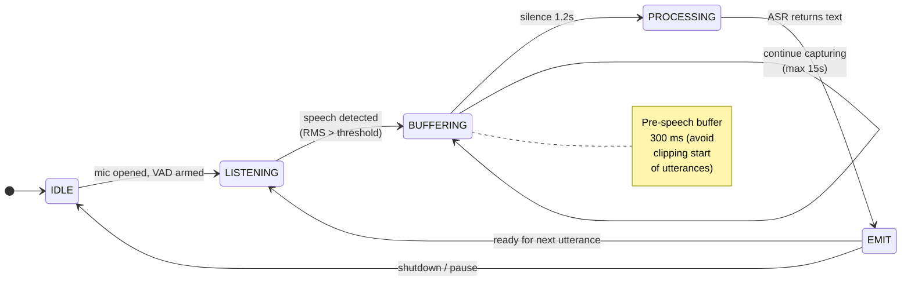
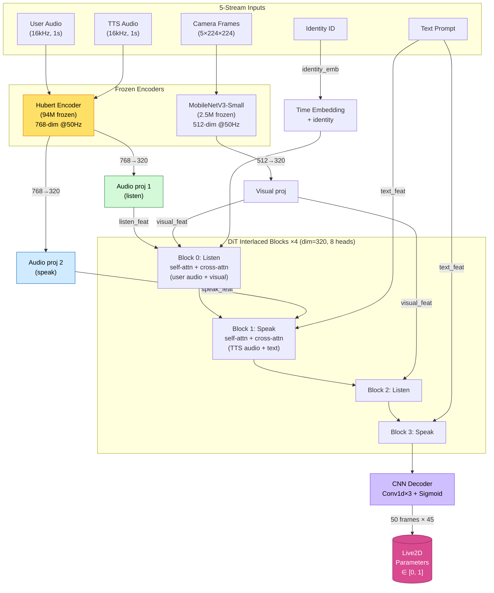
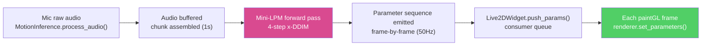
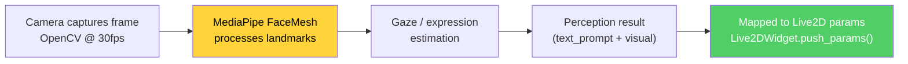
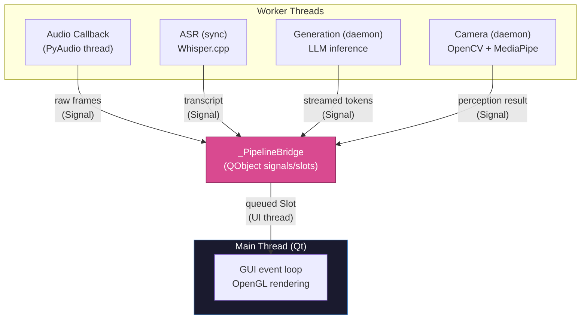

# Amadeus Architecture

## System Overview

Amadeus is a modular pipeline that processes multimodal input (voice, camera) through a series of independent components, drives a Live2D character with synthesized motion, and outputs voice responses through TTS.

## Component Details

### 1. Application Layer (`src/app/`)

**AmadeusWindow** (`window.py`): PySide6 QMainWindow orchestrating the full application lifecycle. Manages all sub-components via `_PipelineBridge` (thread-safe Qt signal bridge for audio→UI communication).

**Live2DWidget** (`live2d_widget.py`): QOpenGLWidget with 60fps timer. Maintains a parameter queue consumed each frame. Maps generic parameter indices to Live2D Cubism parameter names via a lookup table.

### 2. Live2D Rendering (`src/live2d/`)

**Live2DRenderer** (`renderer.py`): Wraps `live2d-py`. Handles model loading (Cubism 3.0+), parameter setting, OpenGL rendering, and cleanup. Falls back to headless mode when no model is configured.

### 3. Audio Pipeline (`src/audio/`)

**MicrophoneCapture** (`capture.py`): PyAudio streaming with callback-based audio delivery. 16kHz mono, configurable chunk size. Exposes device enumeration.

**WhisperASR** (`asr.py`): Whisper.cpp Python bindings wrapper. Auto-downloads GGML model files from HuggingFace. Supports `tiny` through `large` model sizes.

**AudioPipeline** (`pipeline.py`): State machine orchestrating VAD → buffering → ASR:

VAD is energy-based (RMS threshold). Includes pre-speech buffer (300ms) to avoid clipping start of utterances.

### 4. Dialogue (`src/dialogue/`)

**DialogueModel** (`model.py`): Dual-mode LLM inference:
- **Local**: transformers `AutoModelForCausalLM` with INT8/INT4 quantization, MPS (Apple Silicon) support
- **API fallback**: Ollama-compatible HTTP streaming endpoint

**Persona** (`persona.py`): YAML-based character profile with system prompt, tone, and trait vectors. Format prompt as conversation prefix.

**ConversationContext** (`context.py`): Sliding window message history with token estimation and automatic truncation (FIFO, preserving system message).

### 5. Motion Model (`src/motion/`)

**FullDuplexDiT** (`model.py`): Core architecture — multimodal Diffusion Transformer with interlaced Listen/Speak layers. Five input streams: user audio, TTS audio, camera frames, text prompt, character identity. Output: 50 frames × 45 Live2D parameters.

**PerformanceEngine** (`performance.py`): Persona-based post-processing on model output. Six configurable parameters applied as multiplicative adjustments in vectorized numpy. EMA temporal smoothing for `react_speed`. Supports 2D/3D arrays + silence/speak/listen modes.

**Preprocessing Pipeline** (`preprocess/`): Video → training data workflow:
- `face_landmarker.py`: MediaPipe FaceLandmarker → 52 ARKit blendshapes + head pose
- `arkit_to_live2d.py`: YAML-configurable weight mapping → 45 Live2D params
- `video_reader.py`: FFmpeg audio extraction + frame extraction
- `pipeline.py`: End-to-end orchestrator with CLI entry point
- `body_skeleton.py`: YOLOv8-pose stub (deferred from MVP)

**Training** (`training/`):
- `dataset.py`: `MotionDataset` — multimodal dict format, 50Hz alignment, fps resampling (linear interp to 50Hz regardless of source fps), .npz + legacy .npy/.wav support
- `train.py`: **x-prediction** training loop. Features: val split, **full-snapshot checkpointing** (model + optimizer + scheduler + AMP scaler + EMA + epoch), resume (lossless from full snapshots, legacy raw-state_dict supported), `--dataset_type`, and full LoRA integration (`--use_lora`, `--lora_rank`, `--lora_alpha`). New flags: `--weight_decay`, `--warmup_steps`, `--ema_decay`, `--early_stopping_patience`.
- `lora.py`: LoRA training module — `LoRALinear` / `LoRAConv1d` wrappers, `apply/remove/merge/save/load_lora` lifecycle API, monkey-patching approach (no model.py modification)
- `ema.py`: Self-contained EMA of trainable parameters. No third-party dependency. Used for validation loss and final checkpoint save when `--ema_decay > 0`.

**Inference** (`inference.py`): Streaming x-prediction diffusion inference with overlap-add. Maintains audio/visual/tts buffers, processes chunks of `chunk_size` seconds via **4-step x-prediction DDIM** (η=0 deterministic), emits parameter dictionaries frame-by-frame to callbacks. **T is dynamically derived from the Hubert encoder output length** (was previously hardcoded to 50). Loads and **hot-swaps character LoRA adapters** via `set_character_id()` — looks up `models/lora/<id>/lora_adapter.pt` and merges in place.

### 6. TTS (`src/tts/`)

**TTSEngine** (`engine.py`): Multi-backend TTS with graceful degradation:

1. CosyVoice2 → 2. ChatTTS → 3. Fish-Speech → 4. pyttsx3 (system TTS fallback)

Each backend is loaded lazily, returns `np.ndarray` of float32 audio.

### 7. Perception (`src/perception/`)

**CameraPerception** (`camera.py`): OpenCV capture + MediaPipe processing in a background thread. Produces per-frame perception results:
- `face_detected`: boolean
- `gaze`: angle + direction (left/center/right)
- `expression`: mouth openness, smile detection, brow raise

These results are mapped to Live2D parameters (gaze → ParamAngleY, smile → ParamMouthForm, etc.) in the window.

## Data Flow

### Conversation Loop

```mermaid
flowchart LR
    A1["Mic captures audio<br/>PyAudio callback"] --> A2
    A2["VAD detects speech<br/>buffers until silence 1.2s"] --> A3
    A3["Whisper.cpp transcribes<br/>emits text"] --> A4
    A4["Text added to<br/>ConversationContext"] --> A5
    A5["Sent to DialogueModel<br/>(Qwen2.5-3B)"] --> A6
    A6["LLM streams response<br/>to UI display"] --> A7
    A7["Full response sent to<br/>TTS for synthesis"] --> A8
    A8["TTS audio plays<br/>via PyAudio"]

    style A1 fill:#4a90d9,color:#fff
    style A5 fill:#d94a90,color:#fff
    style A8 fill:#51cf66,color:#fff
```

### Motion Loop

### Perception Loop

## Threading Model

Qt `Signal`/`Slot` bridge (`_PipelineBridge`) handles thread-safe communication from audio/generation threads to the UI thread.

## Configuration

All runtime parameters are in `config/default.yaml`. The config is loaded once at startup and passed to all components. Each component reads its own section, allowing independent configuration.
