# Amadeus 算法架构图 (Mermaid)

> **状态**: 反映 `fix/training-pipeline-issues` 分支合并后的当前代码
> **更新日期**: 2026-06-07
> **作用**: 用 Mermaid 图表描述当前系统的算法结构、训练流程和推理路径
>
> **问题历史**: 修复过程中发现的问题及解决方案见 `docs/TRAINING_PIPELINE_REVIEW.md` 和 `docs/adr/0002-x-prediction-and-50hz-alignment.md`

---

## 目录

1. [系统数据流总览](#1-系统数据流总览)
2. [FullDuplexDiT 模型架构](#2-fullduplexdit-模型架构)
3. [DiT Block 内部结构](#3-dit-block-内部结构)
4. [训练管线流程](#4-训练管线流程)
5. [推理管线流程](#5-推理管线流程)
6. [LoRA 微调架构](#6-lora-微调架构)
7. [预处理管线数据流](#7-预处理管线数据流)
8. [性能参数后处理详解](#8-性能参数后处理详解)
9. [训练数据 fps 对齐](#9-训练数据-fps-对齐)
10. [三模态性能引擎状态](#10-三模态性能引擎状态)
11. [x-Prediction 训练全景](#11-x-prediction-训练全景)

---

## 1. 系统数据流总览

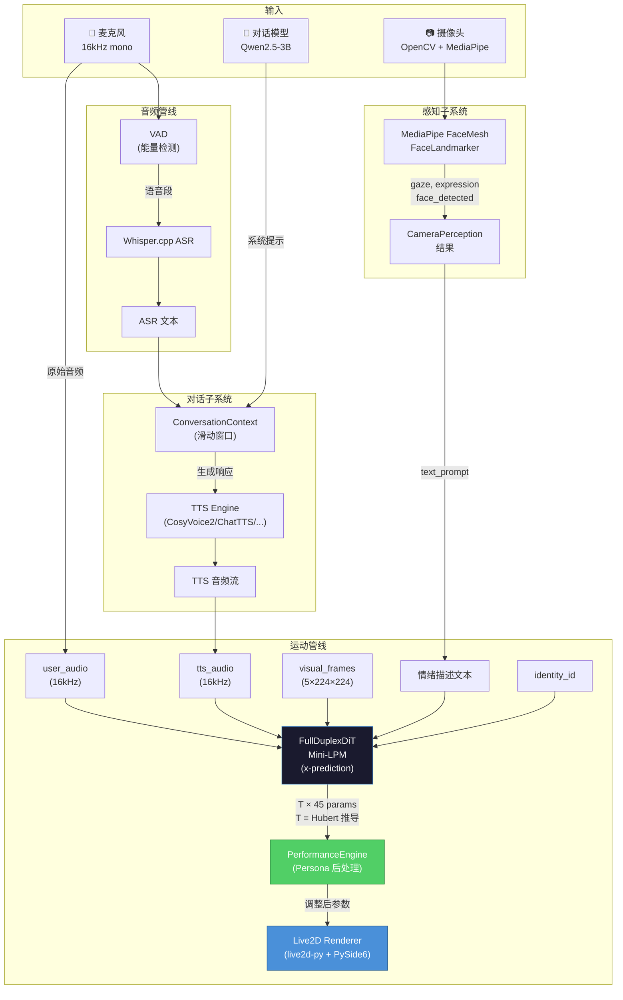

## 2. FullDuplexDiT 模型架构

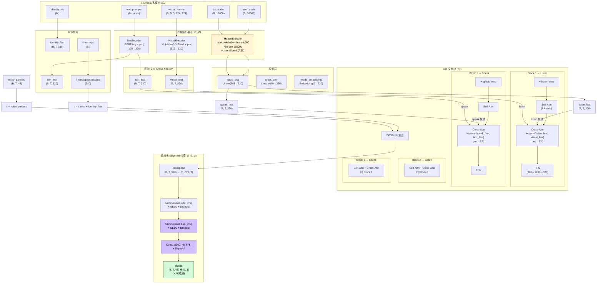

> **Sigmoid 含义**: 输出被约束在 `[0, 1]`,与 Live2D 参数范围天然对齐。配合 **x-prediction** 损失 (`loss = MSE(pred, motion)`),Sigmoid 是模型的正确约束,不再是不兼容的 bug。

## 3. DiT Block 内部结构

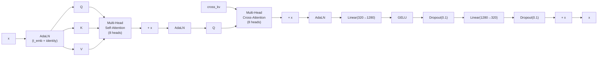

> AdaLN 条件信号: `c = TimestepEmbedding(t) + IdentityEmbedding(id).mean(dim=1)`

## 4. 训练管线流程

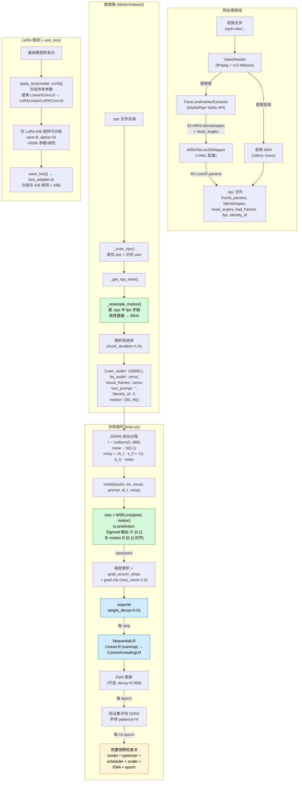

## 5. 推理管线流程

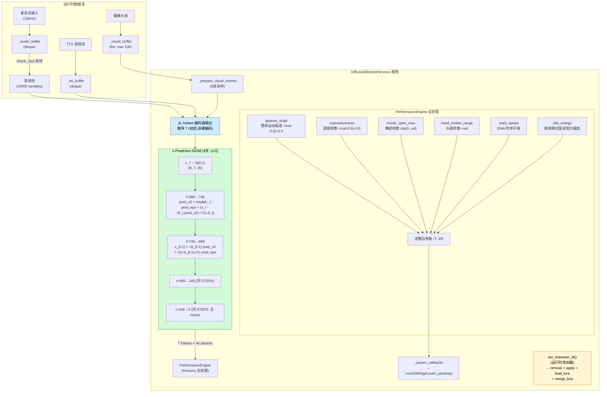

## 6. LoRA 微调架构

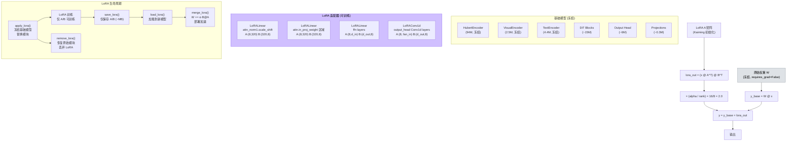

## 7. 预处理管线数据流

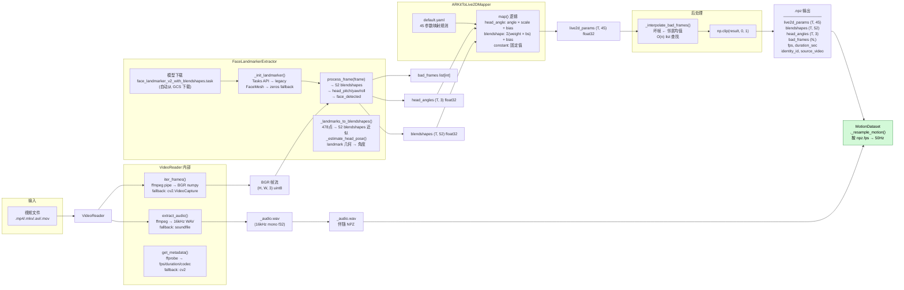

> **fps 对齐**: 数据集读取 `.npz` 中的 `fps` 字段(预处理时存下来的源帧率),按需要线性插值到模型期望的 50 Hz 速率。无需修改预处理脚本。

## 8. 性能参数后处理详解

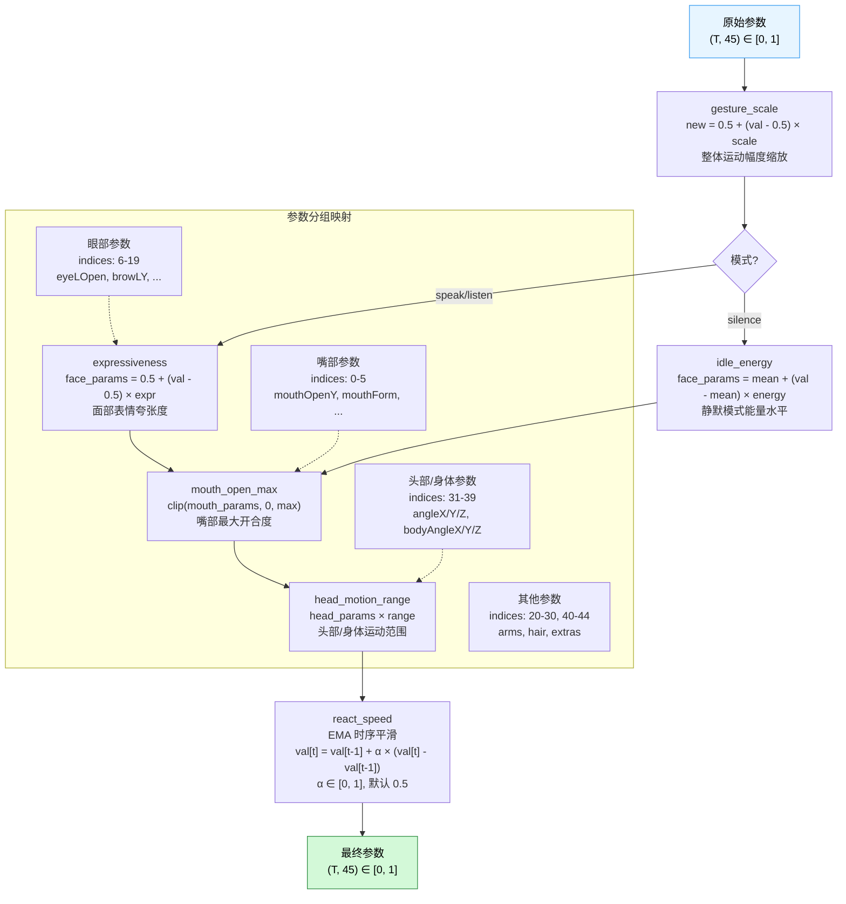

## 9. 训练数据 fps 对齐

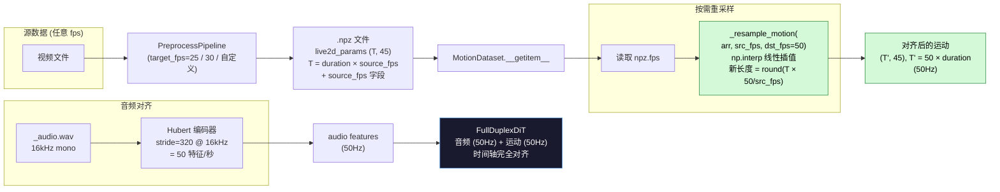

> **数据流保证**: 无论预处理以多少帧率提取,数据集都会在加载时重采样到 50 Hz,与 Hubert 的 stride 完全对齐。模型永远不会收到 zero-padded 输入。

## 10. 三模态性能引擎状态

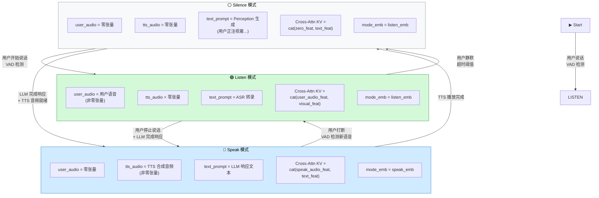

## 11. x-Prediction 训练全景

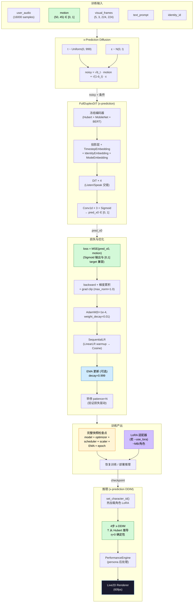

---

*本文件反映 `fix/training-pipeline-issues` 分支合并后的代码状态。所有训练阻断问题 (C1/C2) 与推理缺陷 (H1/H2) 均已修复;质量改进 (M1–M4) 与最佳实践 (L2–L5) 已集成。完整问题史与修复决策见 `docs/TRAINING_PIPELINE_REVIEW.md` 和 `docs/adr/0002-x-prediction-and-50hz-alignment.md`。*