# Amadeus 算法架构图 (Mermaid)

> 生成日期: 2026-06-07  
> 基于代码审查，反映当前实现状态（含已知问题）

---

## 1. 系统数据流总览

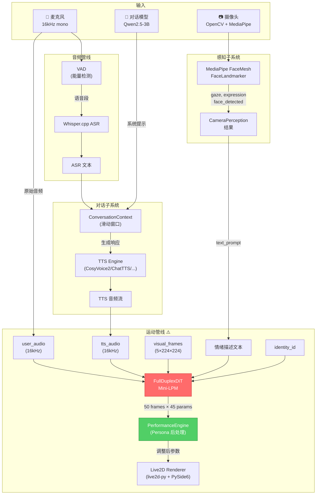

## 2. FullDuplexDiT 模型架构

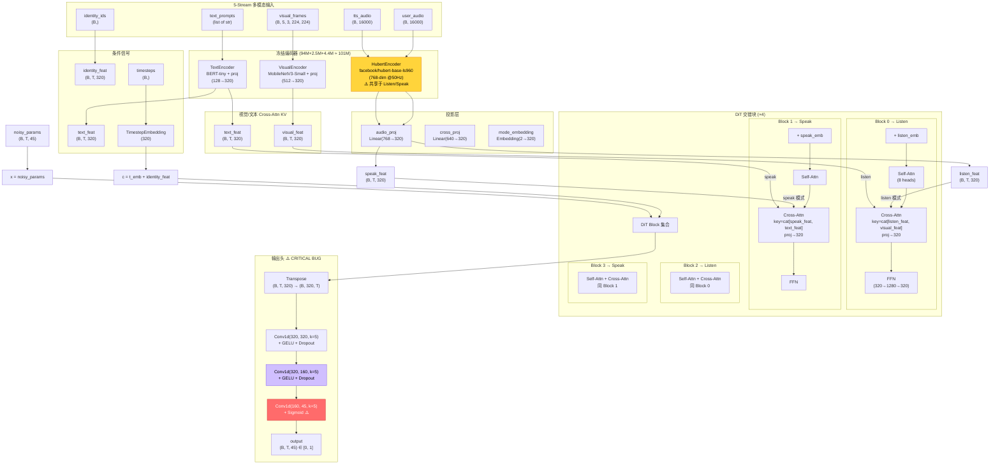

> ⚠️ **Sigmoid + ε-prediction**: 输出 Sigmoid 范围 [0,1]，但训练目标是标准正态噪声 N(0,1)，数学上不兼容。应切换到 x-prediction 或移除 Sigmoid。

## 3. DiT Block 内部结构

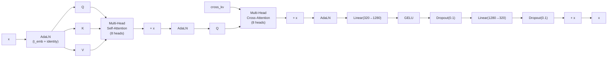

> AdaLN 条件信号: `c = TimestepEmbedding(t) + IdentityEmbedding(id).mean(dim=1)`

## 4. 训练管线流程

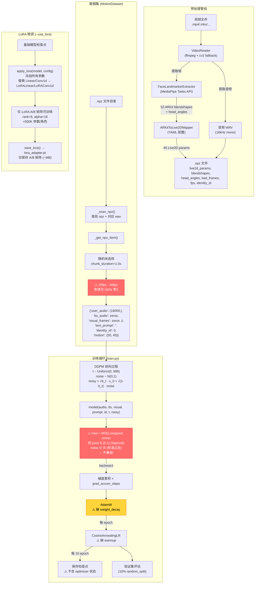

## 5. 推理管线流程

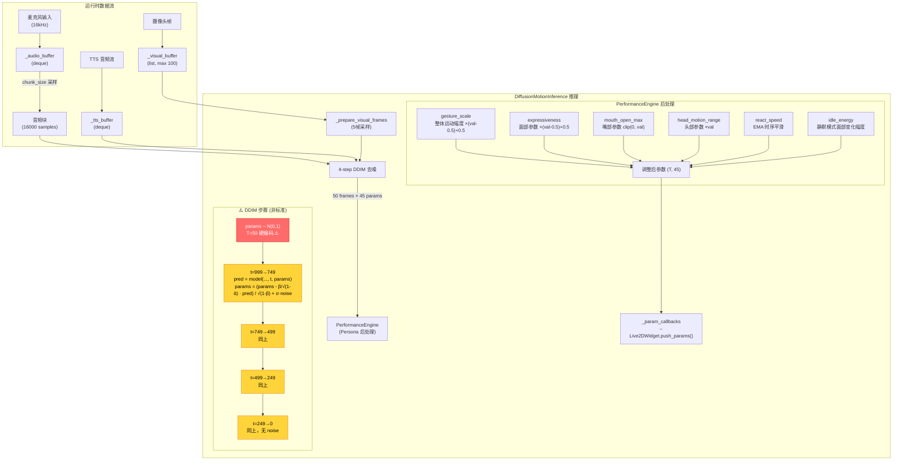

## 6. LoRA 微调架构

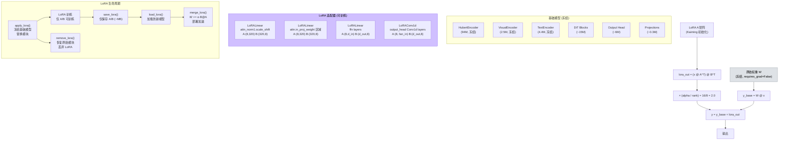

## 7. 预处理管线数据流

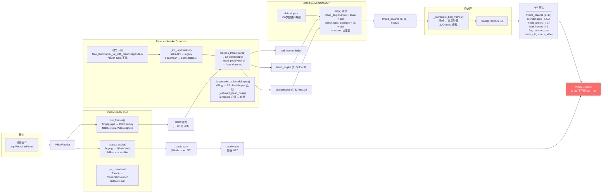

## 8. 性能参数后处理详解

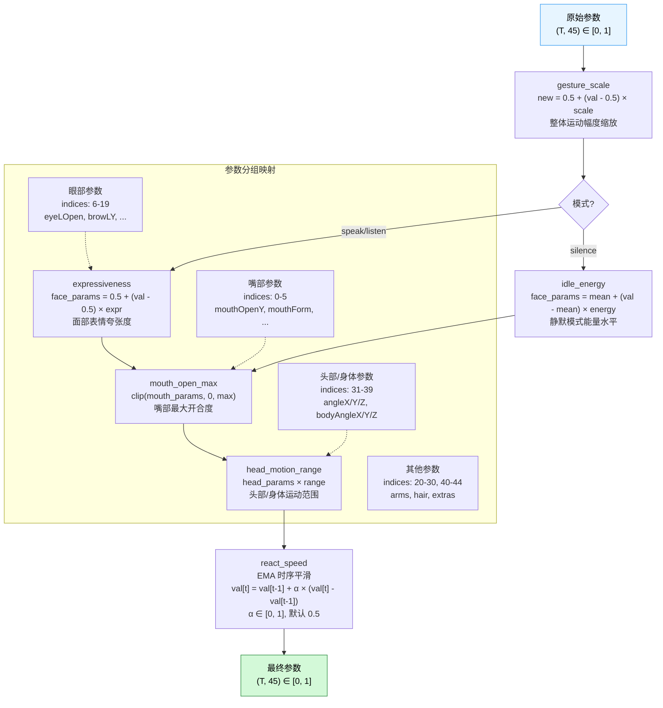

## 9. 训练数据对齐问题详解

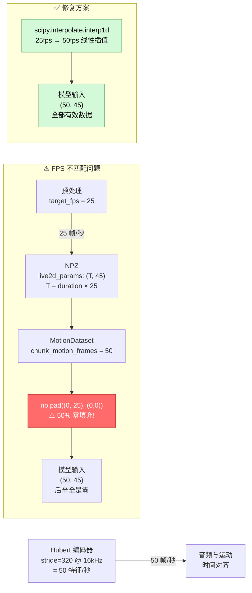

## 10. 三模态性能引擎状态

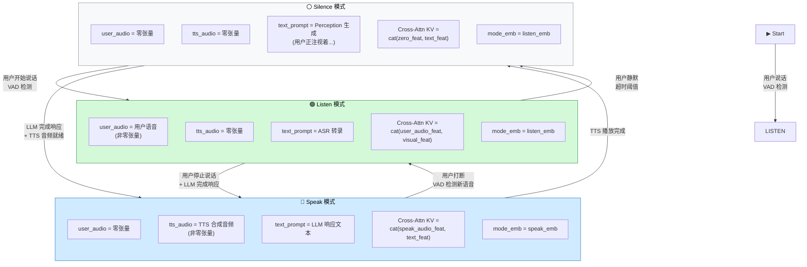

## 11. 问题影响链 (Mermaid)

```mermaid
flowchart TB
    C1["🔴 C1: Sigmoid + ε-prediction<br/>不兼容"] -->|"训练无法收敛"| NO_TRAIN["❌ 无法训练"]
    C2["🔴 C2: FPS 25→50<br/>50% 零填充"] -->|"模型学坏模式"| BAD_MOTION["❌ 运动后半段衰减"]
    C2 -->|"与 C1 叠加"| NO_TRAIN

    H1["🟠 H1: DDIM 推理<br/>公式错误"] -->|"推理质量差"| BAD_INFER["❌ 推理输出无意义"]
    C1 -->|"修复后需重写"| H1_FX["DDIM x-prediction"]
    
    H2["🟠 H2: LoRA<br/>无推理加载"] -->|"角色特化不可用"| NO_CHAR["❌ 无法切换角色"]
    
    M1["🟡 M1: 零视觉帧<br/>视觉通路未训练"] -->|"推理时视觉无效"| NO_VIS["⚠️ 摄像头感知浪费"]
    
    M2["🟡 M2: weight_decay<br/>未传入优化器"] -->|"可能过拟合"| OVERFIT["⚠️ 小数据集过拟合"]
    
    M3["🟡 M3: T=50<br/>硬编码"] -->|"变长音频不同步"| DESYNC["⚠️ 音画不同步"]
    M4["🟡 M4: warmup<br/>未实现"] -->|"训练初期不稳定"| UNSTABLE["⚠️ 早期训练波动"]

    style C1 fill:#ff6b6b,stroke:#c92a2a,color:#fff
    style C2 fill:#ff6b6b,stroke:#c92a2a,color:#fff
    style H1 fill:#ffd43b,stroke:#e67700,color:#000
    style H2 fill:#ffd43b,stroke:#e67700,color:#000
    style M1 fill:#ffe066,stroke:#e67700,color:#000
    style M2 fill:#ffe066,stroke:#e67700,color:#000
    style M3 fill:#ffe066,stroke:#e67700,color:#000
    style M4 fill:#ffe066,stroke:#e67700,color:#000
    style NO_TRAIN fill:#1a1a2e,stroke:#e03131,color:#fff
    style BAD_INFER fill:#1a1a2e,stroke:#e67700,color:#fff
    style NO_CHAR fill:#1a1a2e,stroke:#e67700,color:#fff
```

---

*图中红色 (⚠️ / 🔴) 标记为已知问题，详见 `docs/TRAINING_PIPELINE_REVIEW.md`。*